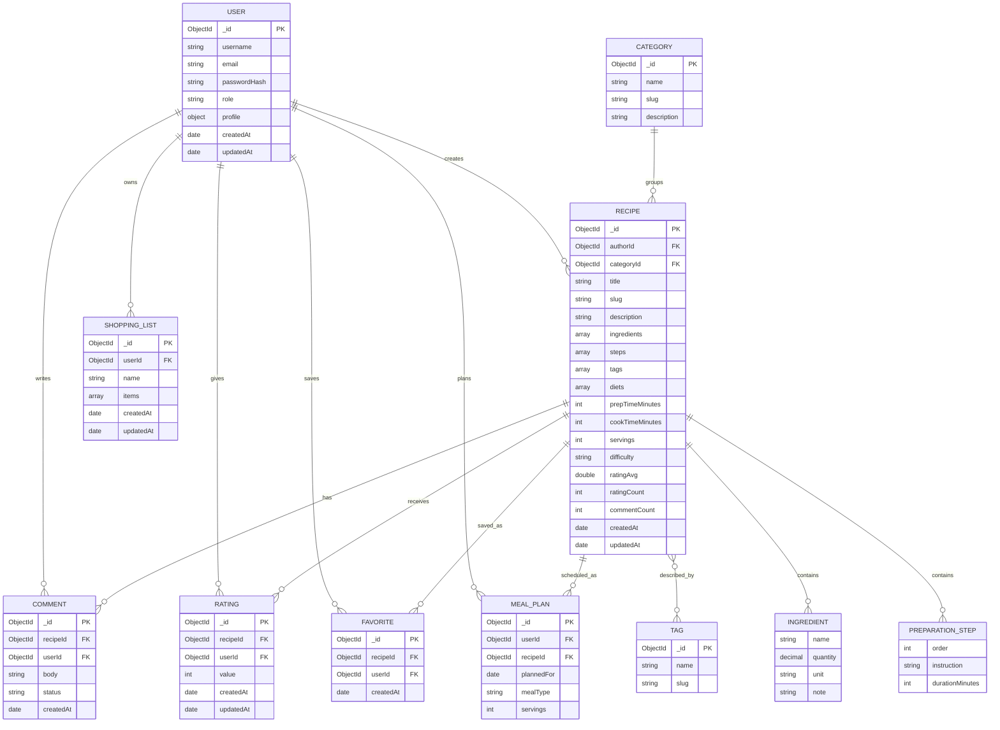

# Model ERD

Model ERD pokazuje relacje logiczne. W MongoDB nie wszystkie relacje sa fizycznymi joinami; czesc danych jest zagniezdzona w dokumencie przepisu dla szybszego odczytu.

## Decyzje modelowania NoSQL

- `ingredients`, `steps`, `nutrition`, `images`, `tags` i dane autora do listingu sa zagniezdzone w `recipes`, poniewaz sa zawsze potrzebne przy wyswietlaniu przepisu.
- `comments` sa osobna kolekcja, bo moga rosnac bez ograniczen i wymagaja paginacji.
- `ratings` sa osobna kolekcja, zeby wymusic jedna ocene uzytkownika dla przepisu i pozwolic na aktualizacje oceny.
- W `recipes` przechowywane sa pola agregowane `ratingAvg`, `ratingCount`, `commentCount`, `favoriteCount`, co przyspiesza listy i sortowanie.
- `favorites`, `shoppingLists` i `mealPlans` sa osobnymi kolekcjami, poniewaz sa powiazane z aktywnoscia konkretnego uzytkownika.
